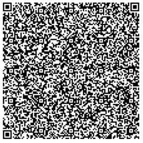

# CH - Switzerland

* **JSON schema version**: 1.2.1

Used for productive DCCs issuance
* from: 07.06.2021
* until:

## Test files

### Vaccination




 
### Recovery


### Special cases and deviations
A number of DCCs have been issued with country code "CH BAG", instead of "CH"

Snipped from decoded specialcases/REC_CH_BAG.png:
```
{
  "tag": 18,
  "value": [
    { "Map": [ [ 1, -37 ], [ 4, "JLxre3vSwyg" ] ] },
    {},
    {
      "Map": [
        [ 1, "CH BAG" ],
        [ 4, 1654185135 ],
        [ 6, 1622649135 ],
```

### Vaccination


### Recovery


