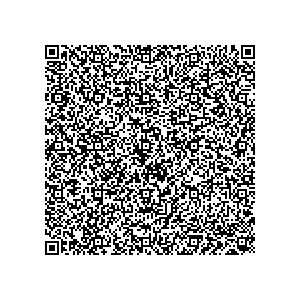

# CH - Switzerland

* **JSON schema version**: 1.3.0

Used for productive DCCs issuance
* from: 12.07.2021
* until:

## Test files

### Vaccination

### Recovery

### Test

## Special Cases

### Test

Field "ma" (manufacturer) exists but is empty.
The field is optional, so it should be accepted by verifier apps.
However, empty string is not part of the allowed value sets

