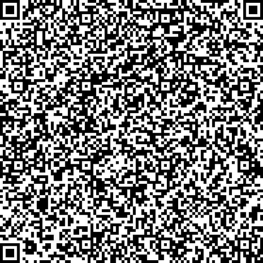
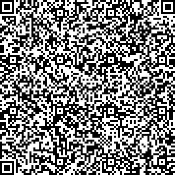
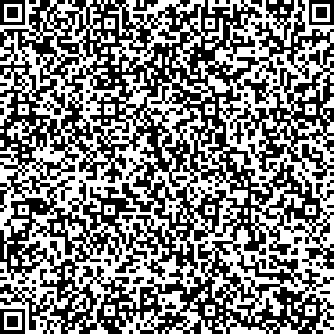

# DE - Germany

* **JSON schema version**: 1.0.0

Used for productive DCCs issuance
* From: 01.06.2021
* Until:

## Test files

### Vaccination

### Invalidated Issuer Vaccination

### Test

### Recovery

### Special cases and deviations
None
