# DE - Germany

* **JSON schema version**: 1.3.0

Used for TEST DCCs issuance

## Test files

### Vaccination

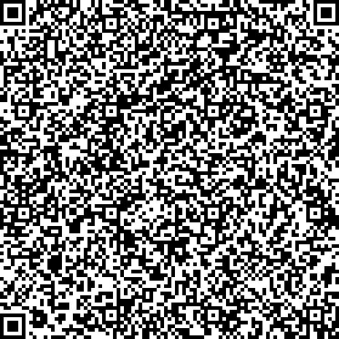

### Test

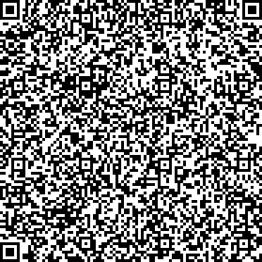

### Recovery

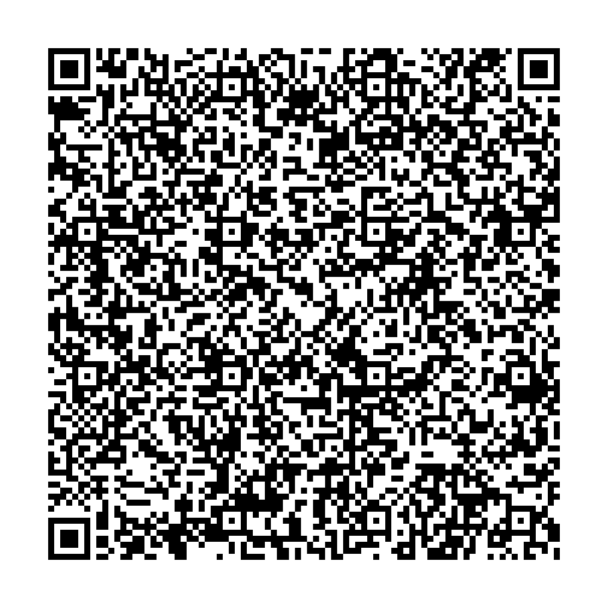

### Vaccination invalidated

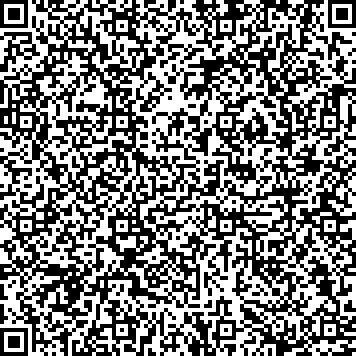

### Recovery revoked
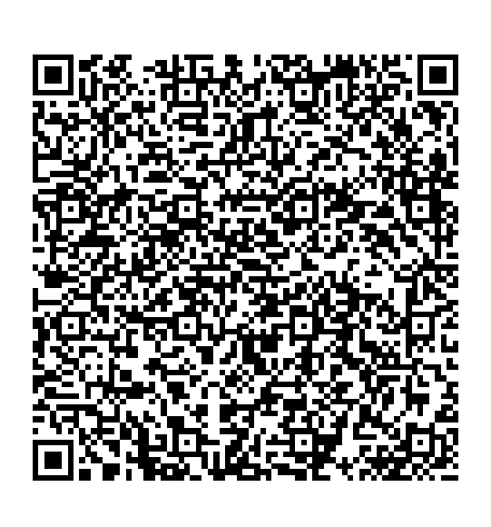

### Vaccination revoked
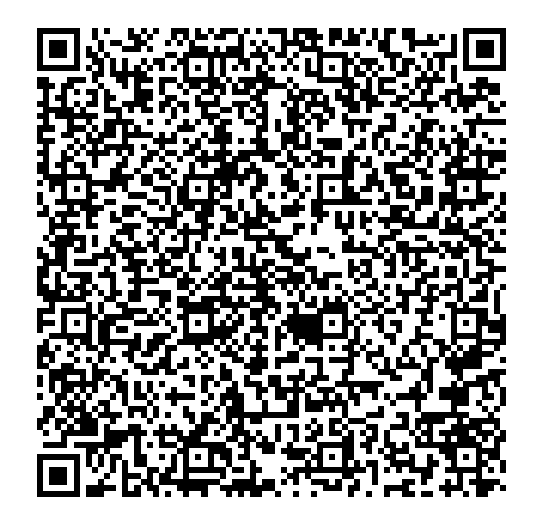
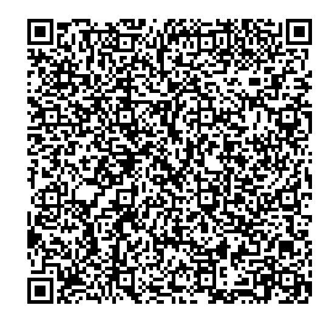

# Revocations (CovPass)

Revoked, until 2022-04-30

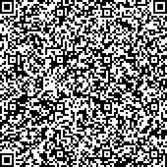 
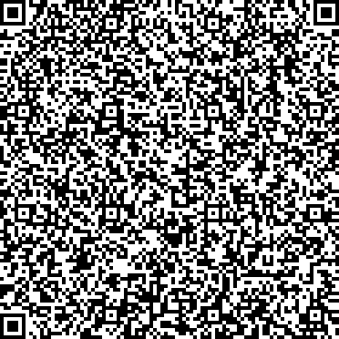
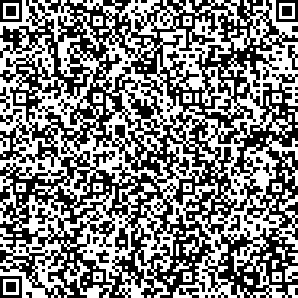
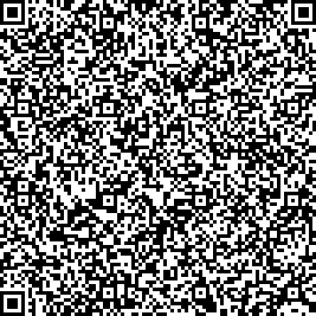
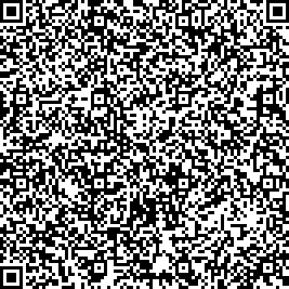
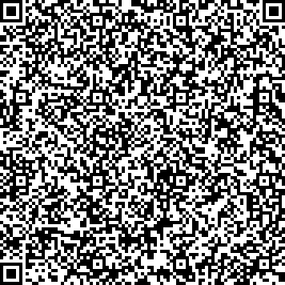
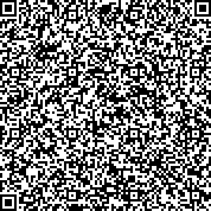
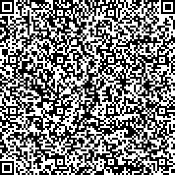
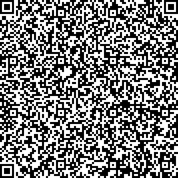
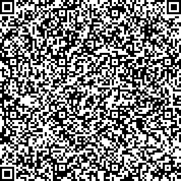
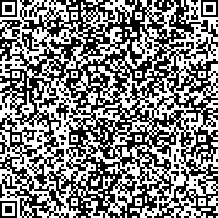
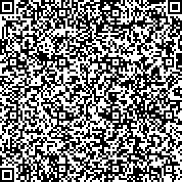
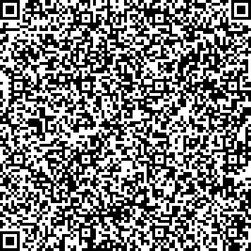
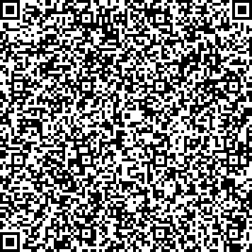
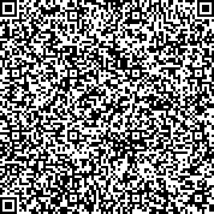
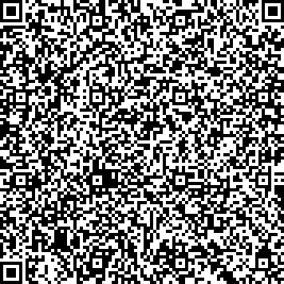
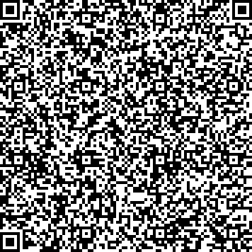
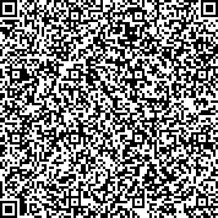
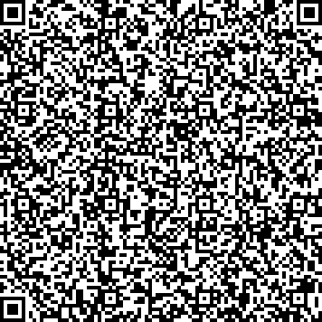
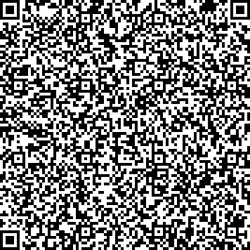
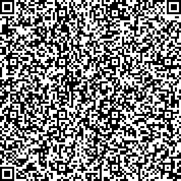
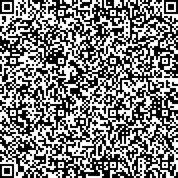
