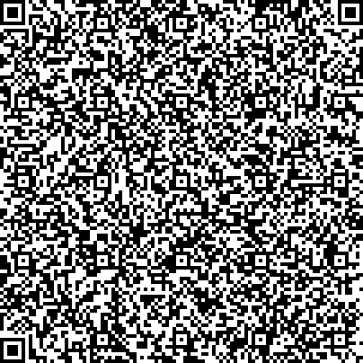

# DE - Germany

* **JSON schema version**: 1.3.0

Used for TEST DCCs issuance

## Test files

### Vaccination

### Test

### Recovery

### Vaccination invalidated

### Recovery revoked

### Vaccination revoked

# Revocations (CovPass)

Revoked, until 2022-06-30

