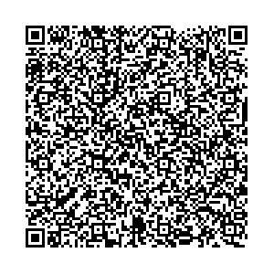

# ES - Spain

* **JSON schema version**: 1.3.0

Used for productive DCCs issuance
* From: 16.08.2021
* Until:

## Test files

### Vaccination

### Recovery

Used for productive DCCs issuance
* From:  16.08.2021
* Until: 

### Test

* Test NAAT

* Test RAT

### Special cases and deviations

The following QRs are from different Autonomous Communities (emitting entities) within Spain requiring validation in Europe. 

Used for productive DCCs issuance
* From: 16.08.2021
* Until:

### Test

### Test NAAT

* Balearic Islands (issuer: Illes Balears: Servei de Salut / Servicio de Salud / Health Service) - NAAT

* Castilla y Leon (issuer: Gerencia Regional de Salud de Castilla y León) - NAAT

### Test RAT

* Balearic Islands (issuer: Illes Balears: Servei de Salut / Servicio de Salud / Health Service) - RAT

Used for productive DCCs issuance
* From: 16.08.2021
* Until: 

### Vaccination

* Extremadura (issuer: Servicio Extremeño de Salud) - VAC

* Asturias (issuer: Consejería de Salud del Principado de Asturias) - VAC

* Aragon (issuer: Departamento de Sanidad Gobierno de Aragón) - VAC

* Castilla y Leon (issuer: Gerencia Regional de Salud de Castilla y León) - VAC

### Recovery

* Extremadura (issuer: Servicio Extremeño de Salud) - REC 

* Asturias (issuer: Consejería de Salud del Principado de Asturias) - REC

* Aragon (issuer: Departamento de Sanidad Gobierno de Aragón) - REC

* Balearic Islands (issuer: Illes Balears: Servei de Salut / Servicio de Salud / Health Service) - REC

* Castilla y Leon (issuer: Gerencia Regional de Salud de Castilla y León) - REC

