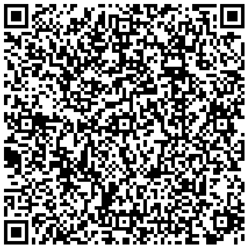
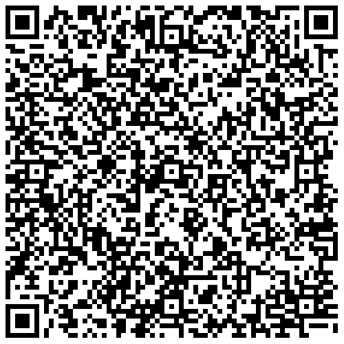
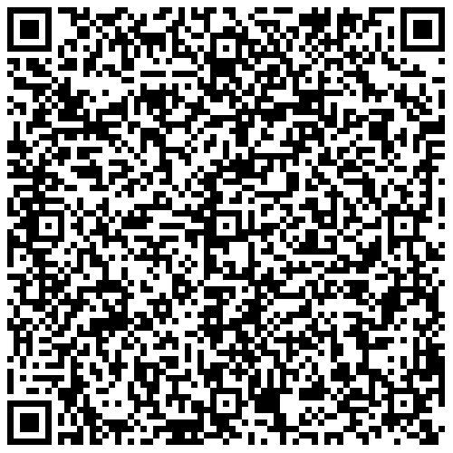
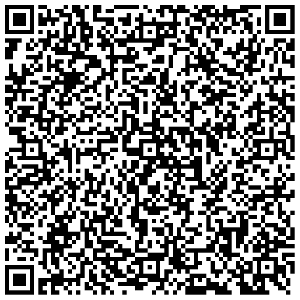
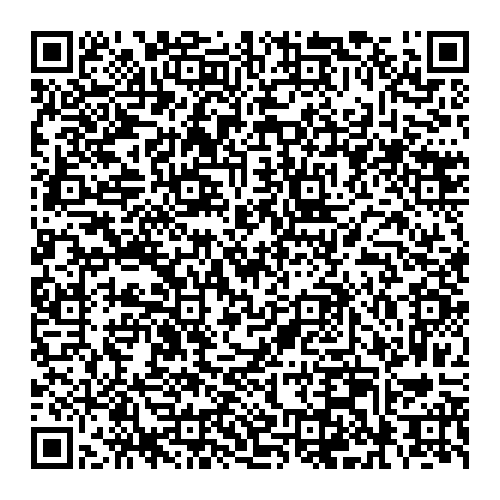
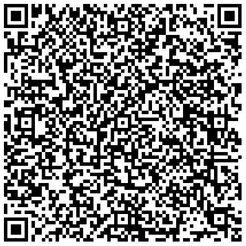

# FI - Finland

* **JSON schema version**: 1.3.0

Used for productive DCCs issuance
* From: 08.07.2021
* Until:

## Test files

### Vaccination 1/2, administered 5.6.2021 

### Vaccination 2/2, administered 5.6.2021 

### Vaccination 3/3, administered 14.7.2021 

### NAAT, administered 14.7.2021

### [RAT, administered 14.7.2021

### Recovery, positive test taken 20.5.2021

