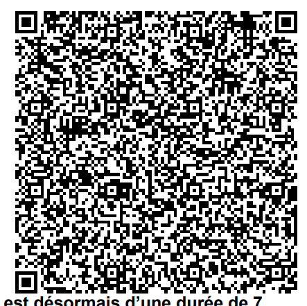

# FR - France

* **JSON schema version**: 1.3.0

Used for productive DCCs issuance
* From: 23.06.2021
* Until:

## Test files

### Recovery DCC

  

### Special cases and deviations

### Vaccination

Has CNAM instead of FR for issueing country
  

Has invalid value for test manufacturer
  
