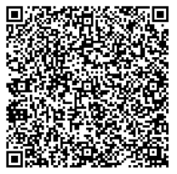

# IE: Ireland, test files

---

### 1 - Vaccination certificate: One immunisation event

All tests should be successful.

### 2 - Test certificate

### 3 - Recovery certificate

### Special cases and deviations

Vaccine certs contain floats for sd and dn instead of int values

