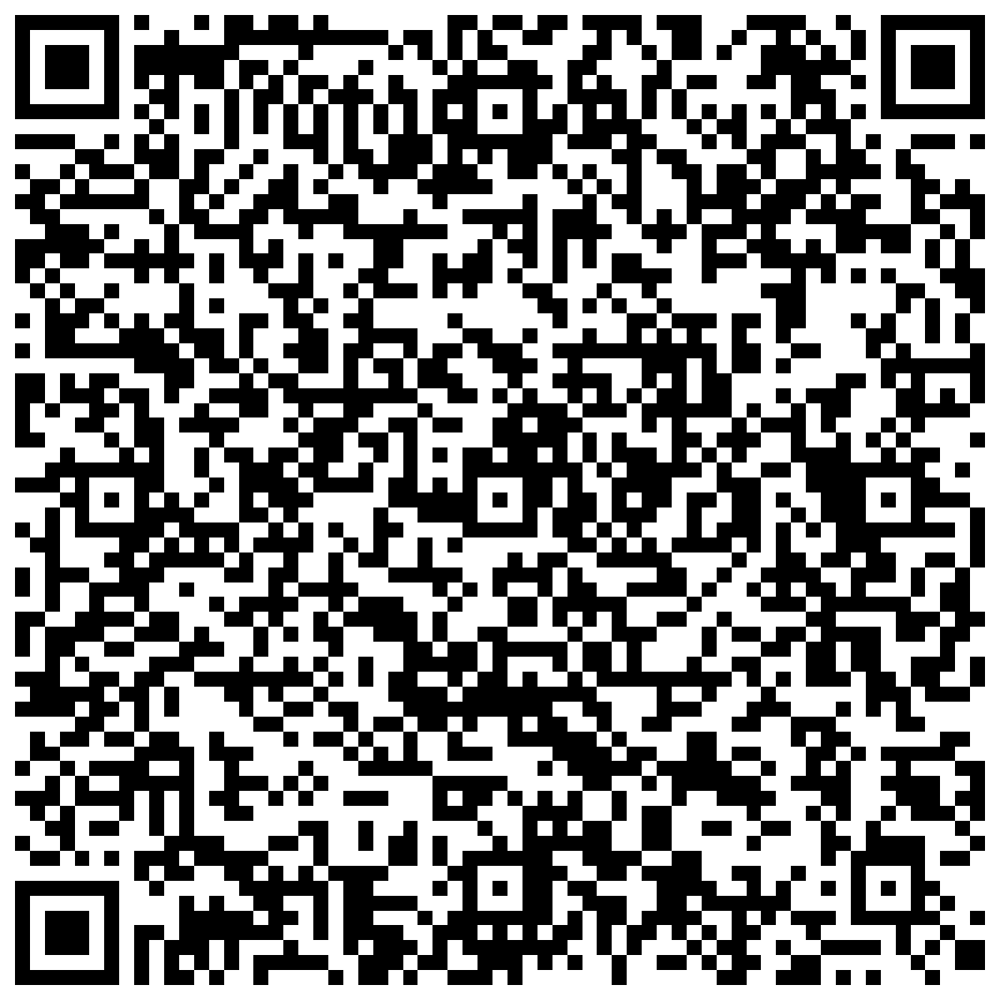
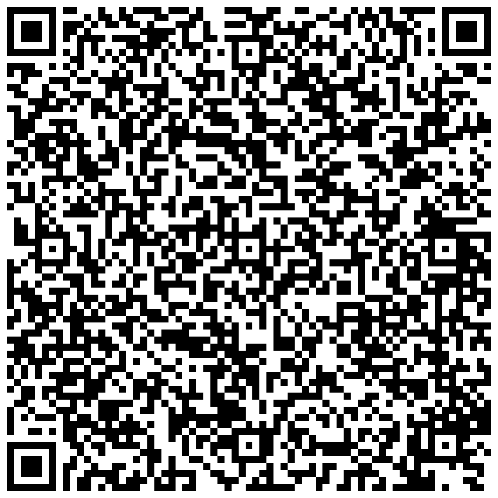

# LI - Liechtenstein

* **JSON schema version**: 1.3.0

Used for productive DCCs issuance
* From: 21.06.2021
* Until:

## Test files

### Vaccination

### Test

### Recovery 1 and 2 (with different Start dates)

.png)

### Recovery

.png)

### Special cases and deviations
None