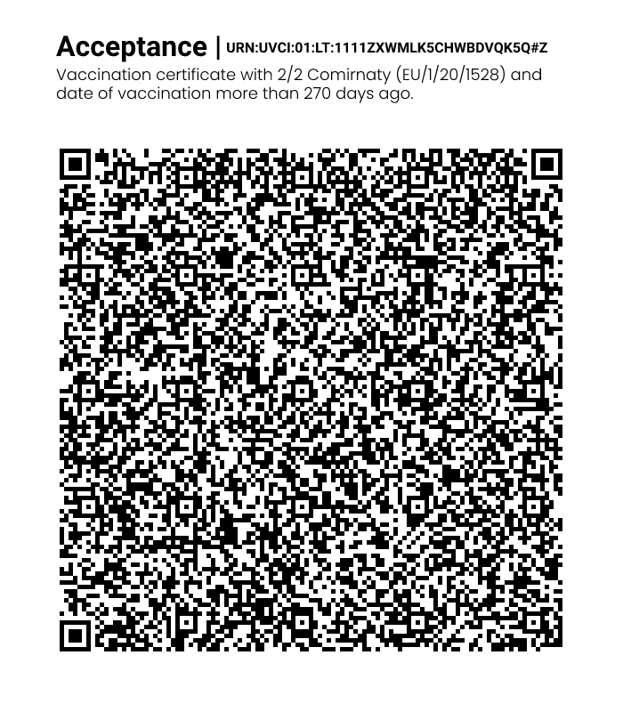

# LT - Lithuania

**JSON schema version**: 1.3.0

Used for productive DCCs issuance
* From: 19.01.2022
* Until: 

## Test files

### Vaccination

### Test

#### NAAT:

#### RAT:

### Recovery

### Special cases and deviations

* Test certificates have 'sc' date-time strings that ***ARE NOT*** tagged with CBOR TAG 0.
* Provided different vacination certificate combinations (3/3, 2/1 and 2/2 older than 270 days).
* Provided different certificates for NAAT (Nucleic acid amplification with probe detection) and RAT (Rapid Antigen Test) tests.