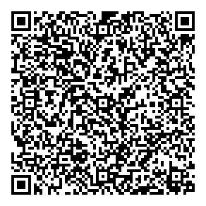

# LV - Latvia

* **JSON schema version**: 1.3.0

Used for productive DCCs issuance
* From: 31.01.2022
* Until:

## Test files

### Vaccination

Vaccination - Booster Janssen 3/1

Vaccination - Booster Janssen 2/2

Vaccination - Booster Comirnaty 3/3

Vaccination - Recovery + 1 dose of Comirnaty

Vaccination - Janssen 1/1

Vaccination - Comirnaty 2/2

Vaccination - Spikevax 12/12

### Test

Test - NAAT

Test - RAT

### Recovery

### Revoked

### Special cases and deviations

-
