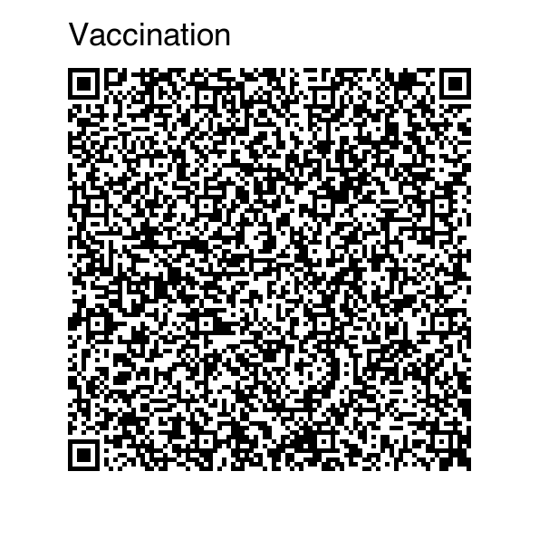
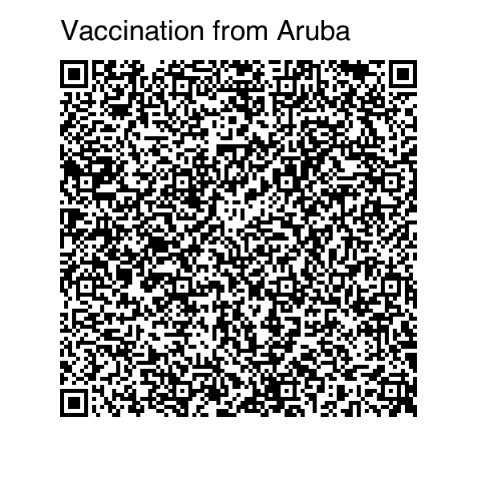
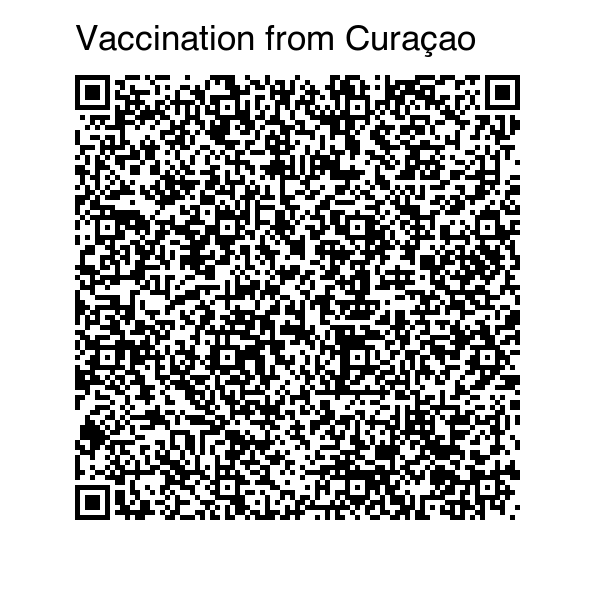
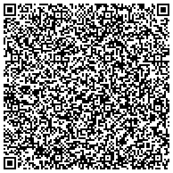
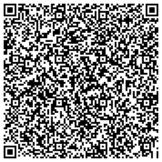
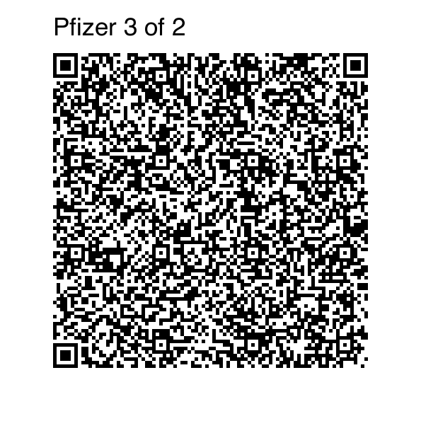
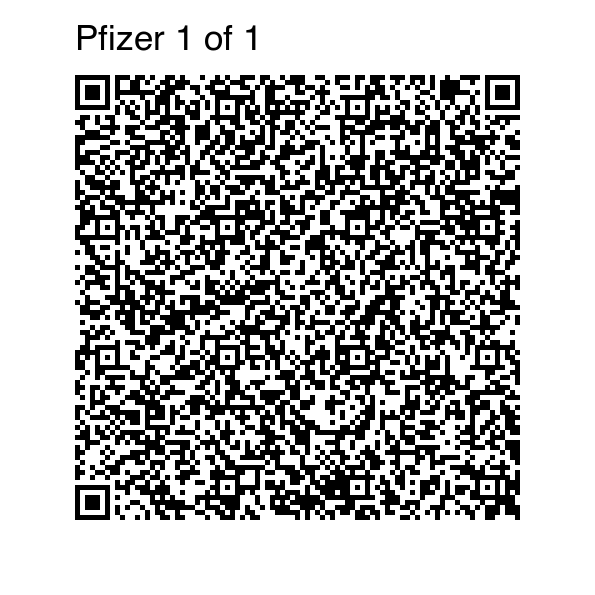
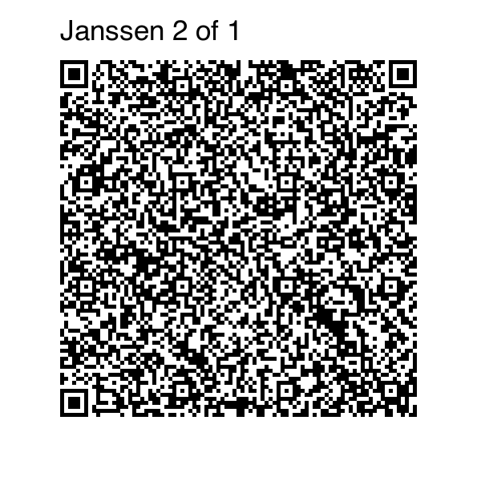

# NL - Netherlands

* **JSON schema version**: 1.3.0

Used for production DCCs issuance
* From: 01.07.2021
* Until:

## Test files

### Vaccination

From Aruba (AW)

From Curaçao (CW)

Sint Maarten (SX)

### Test

### Recovery

### Special cases

We'd like to test how the verifier application of different countries handle additional doses beyond the regular amount.

Vaccination Pfizer 3 of 3 doses

Vaccination Pfizer 3 of 2 doses

Vaccination Pfizer 1 of 1 doses

Vaccination Janssen 2 of 1 doses

