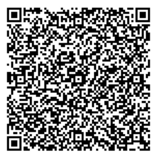

# NL - Netherlands

* **JSON schema version**: 1.0.0

Used for productive DCCs issuance
* From: 01.07.2021
* Until:

## Test files

### Vaccination

### Test

### Recovery

### Special cases and deviations

Empty "dr" field

Vaccination from Aruba (AW)

Vaccination from Curaçao (CW)

Vaccination from Sint Maarten (SX/SXM)

