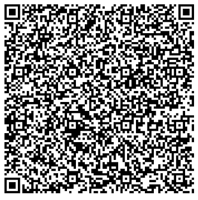
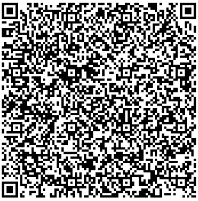
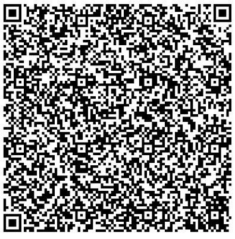
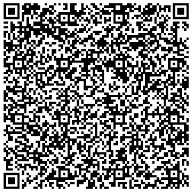

# Serbia

---

### 1 - Vaccination certificate: Partial immunisation

Basic DCC with one vaccination entry, partial immunisation (1/2). Signed with a DSC uploaded in the ACC environment.

All tests should be successful.

### 2 - Vaccination certificate: Full immunisation

Basic DCC with one vaccination entry, full immunisation (2/2). Signed with a DSC uploaded in the ACC environment.

### 2 - Test certificate (PCR Test)

Basic DCC with one test entry. Signed with a DSC uploaded in the ACC environment.

### 4 - Recovery certificate

Basic DCC with one recovery entry. Signed with a DSC uploaded in the ACC environment.

