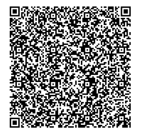
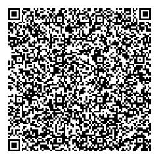
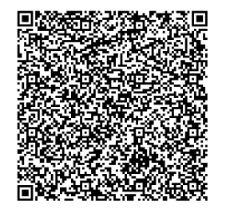
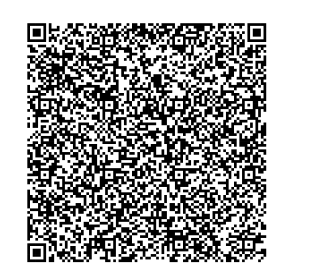
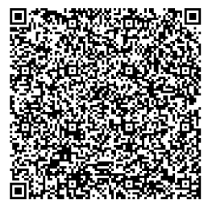

# Serbia

---

From: 18.11.2021

### 1 - Vaccination certificate: Partial immunisation

Basic DCC with one vaccination entry, partial immunisation (1/3). Signed with a DSC uploaded in the ACC environment.

All tests should be successful.

### 2 - Vaccination certificate: Partial immunisation

Basic DCC with one vaccination entry, partial immunisation (2/3). Signed with a DSC uploaded in the ACC environment.

All tests should be successful.

### 3 - Vaccination certificate: Complete immunisation

Basic DCC with all vaccination entry, complete immunisation (3/3). Signed with a DSC uploaded in the ACC environment.

All tests should be successful.

### 4 - Test certificate (PCR Test)

Basic DCC with one test entry. Signed with a DSC uploaded in the ACC environment.

### 5 - Recovery certificate

Basic DCC with one recovery entry. Signed with a DSC uploaded in the ACC environment.

