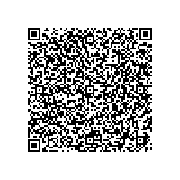

# TG - Togo

* **JSON schema version**: 1.3.0

## Test files

### Vaccination

Additional data in DCC: 
- "meta" attribute serves to comply with the WHO Smart Vaccine Certificate and also for compatibility purpose with  our legacy national vaccination system (should be ignored by EU verifiers)
- "meta.pr" attribute is a string field referencing the vaccination program name (Only for togo and should be ignored by EU verifiers) 
- "meta.vcnm" attribute is a string field referencing the vaccination health worker as required by WHO smart vaccine certificate (Only for togo and should be ignored by EU verifiers) 
- "meta.bat" attribute is a string field referencing the vaccine batch number as required by WHO smart vaccine certificate (Only for togo and should be ignored by EU verifiers)
- "meta.ecn" attribute is a string field referencing the subject unique identifier in Togo vaccine health Information system as required by WHO smart vaccine certificate (Only for togo and should be ignored by EU verifiers)
- "meta.sex" attribute is a string referencing the subject gender as required by WHO smart vaccine certificate (Only for togo and should be ignored by EU verifiers)
- "meta.nat" attribute is a string referencing the subject nationality (ISO-3166 country List) as required by WHO smart vaccine certificate (Only for togo and should be ignored by EU verifiers)
- "meta.idn" attribute is a string referencing the subject ID and ID expiring date for control purpose,as required by WHO smart vaccine certificate (Only for togo and should be ignored by EU verifiers)
                    
- claim key 2 from RFC 8392 is the purpose of the CWT as requested by our national backend system (only for Togo)
- claim key 7 from RFC 8392  is the CTI as requested by our national backend system (only for Togo)

### Test

Additional data in DCC: 
- "idn" attribute is a string referencing the subject ID as required by our national system(Only for togo and should be ignored by EU verifiers)
- "sex" attribute is a string referencing the subject gender as required by our national system (Only for togo and should be ignored by EU verifiers)
- "nat" attribute is a string referencing the subject nationality (ISO-3166 country List) (Only for togo and should be ignored by EU verifiers and may be different from t.0.co which is the country of test) 
- claim key 2 from RFC 8392 is the purpose of the CWT as requested by our national backend system (only for Togo)
- claim key 5 from RFC 8392  is the nbf as requested by our national backend system. should be override by  business rule if any (only for Togo)
- claim key 7 from RFC 8392  is the CTI as requested by our national backend system (only for Togo)

### FULL COMPATIBILITY WITH EU SCHEMA

### VAC

- claim key 2 from RFC 8392 is the purpose of the CWT as requested by our national backend system (only for Togo)
- claim key 5 from RFC 8392  is the nbf as requested by our national backend system. should be override by  business rule if any (only for Togo)

### Test

- claim key 2 from RFC 8392 is the purpose of the CWT as requested by our national backend system (only for Togo)
- claim key 5 from RFC 8392  is the nbf as requested by our national backend system. should be override by  business rule if any (only for Togo)
- claim key 7 from RFC 8392  is the CTI as requested by our national backend system (only for Togo)
