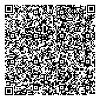

# TG - Togo

* **JSON schema version**: 1.3.0

## Validation round 2

### Test certificate

### Boost vaccine certificate 3/3

### Invalid Vaccine certificate (2/3) on rule (dn >= sd')

## Test files

### FULL COMPATIBILITY WITH EU SCHEMA

### VAC

- claim key 2 from RFC 8392 is the purpose of the CWT as requested by our national backend system (only for Togo)
- claim key 5 from RFC 8392  is the nbf as requested by our national backend system. should be override by  business rule if any (only for Togo)

### Test

- claim key 2 from RFC 8392 is the purpose of the CWT as requested by our national backend system (only for Togo)
- claim key 5 from RFC 8392  is the nbf as requested by our national backend system. should be override by  business rule if any (only for Togo)
- claim key 7 from RFC 8392  is the CTI as requested by our national backend system (only for Togo)

